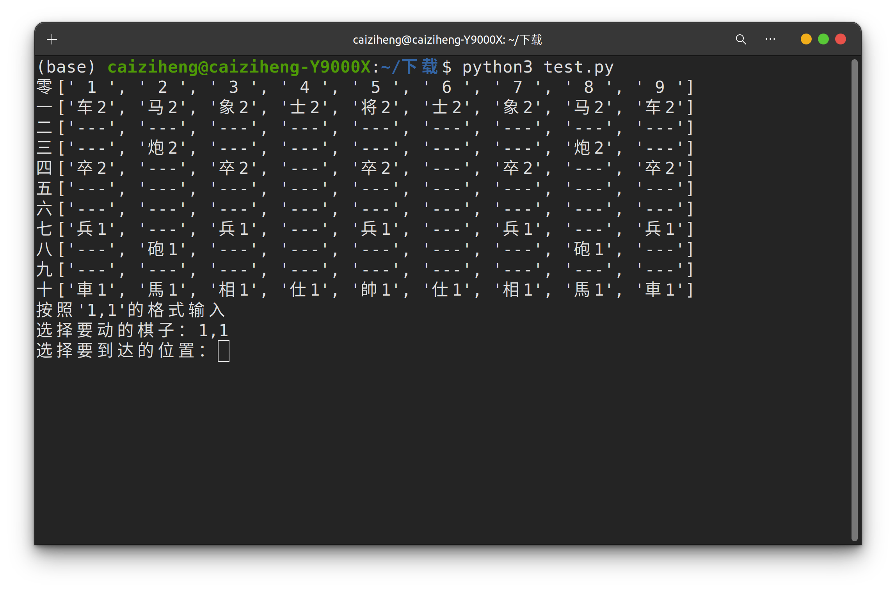
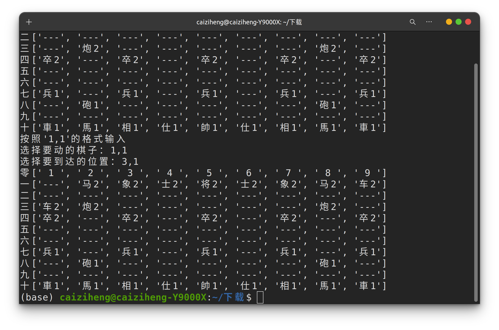
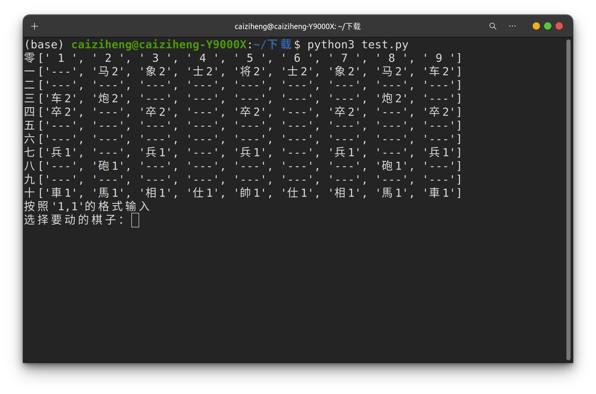

### 在linux服务器终端上进行的中国象棋

##### 使用说明
- 将工程打包下载，包含test.py,init.txt,init copy.txt

- test.py
    - 包含了游戏运行的棋盘绘制（在终端），和运行代码
- init.txt
    - 初始棋盘，运行时不需要处理该txt，只为创建copy副本
- init copy.txt
    - 由init.txt复制而来，每局游戏开始之前需要先将init复制为init copy保存至本地
    - 每次玩家走棋时都会更新该txt，并在下一名玩家走棋之前将最新的棋盘情况在终端显示出来

##### 游戏说明
- 开局，在目录下运行python3 test.py即可，初始棋盘如下所示

- 由玩家1选择要移动的棋子，如需要选择‘车2’，在终端输入‘1,1’

- 由玩家1选择要到达的位置，如需要将‘车2’移动至‘炮2’的左边，则输入‘3,1’

- 轮到对方走棋，对方也只需要在服务器的该目录下运行python3 test.py，即可看到最新的棋盘

###### PS：对战双方可以在自己的电脑上连接同一个linux服务器，从而进行对战
###### Tips：如果有修改的新需求，可以在issue中发布，我会及时更新代码版本，让在实验室的同学可以在学习之余和身边的同学对弈